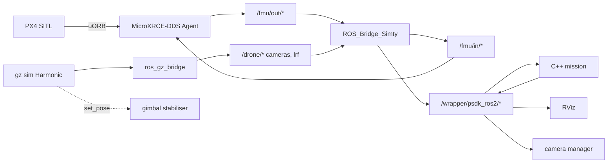

# The ROS 2 architecture

Every node, every topic, every service — and how a PX4 message becomes a DJI
one.

---

## Contents

1. [The graph](#1-the-graph)
2. [The nodes](#2-the-nodes)
3. [The translation layer](#3-the-translation-layer)
4. [Telemetry topics](#4-telemetry-topics)
5. [Command topics](#5-command-topics)
6. [Services](#6-services)
7. [Frames and conventions](#7-frames-and-conventions)
8. [QoS](#8-qos)
9. [Time](#9-time)
10. [Discovery](#10-discovery)
11. [What a real M4E does differently](#11-what-a-real-m4e-does-differently)

---

## 1. The graph

```
      ┌─────────┐  uORB   ┌──────────────┐        ┌──────────────┐
      │  PX4    │────────►│ MicroXRCE    │───────►│ /fmu/out/*   │──┐
      │  SITL   │◄────────│ DDS Agent    │◄───────│ /fmu/in/*    │◄─┤
      └────┬────┘         └──────────────┘        └──────────────┘  │
           │ gz-transport                                           │
      ┌────▼────┐         ┌──────────────┐        ┌──────────────┐  │
      │ gz sim  │────────►│ ros_gz_bridge│───────►│ /drone/*     │──┤
      │ Harmonic│◄────────│ (bridge.yaml)│◄───────│ cameras, lrf │  │
      └────┬────┘         └──────────────┘        └──────────────┘  │
           │                                                        │
           │ set_pose 50 Hz          ┌──────────────────────────────▼──┐
      ┌────▼──────────────┐          │  ROS_Bridge_Simty  ("the bridge")│
      │ gimbal stabiliser │          │  44 routes · 59 service servers  │
      │ + pose relay      │          └──────────────┬───────────────────┘
      └───────────────────┘                         │
                                                    ▼
                          ┌─────────────────────────────────────────────┐
                          │  /wrapper/psdk_ros2/*                       │
                          │  telemetry · 5 command topics · 56 services │
                          └──┬──────────┬──────────┬───────────┬────────┘
                             │          │          │           │
                       C++ mission    RViz      rosbag    camera manager
```

Two things to notice.

**The wrapper surface is the only interface a mission sees.** Everything to the
left of it is implementation. That boundary is what makes the same binary run
against a real aircraft.

**Nothing crosses the boundary in both directions except the bridge.** If two
things published a wrapper topic, a subscriber would get interleaved messages
from both with nothing saying so — which is why the constraint rules exist and
why the bridge watches for foreign publishers (`SurfaceState.FOREIGN`).



---

## 2. The nodes

| node | started by | what it does |
|---|---|---|
| `px4` | the `sim` unit | PX4 SITL. Speaks uORB over uXRCE-DDS |
| `MicroXRCEAgent` | the `sim` unit | turns PX4's uORB into the `/fmu/*` DDS topics. Without it there is no telemetry at all |
| `gz sim` (server) | the `sim` unit | physics and sensor rendering |
| `gz sim -g` | the `sim` unit | the Gazebo window, when a display is available |
| `ros_gz_bridge` | the `sim` unit | Gazebo topics → ROS, from a generated `bridge.yaml`. Every camera row is `lazy` |
| `gimbal_pose_relay` | the `sim` unit | watches the aircraft's Gazebo pose, republishes it on ROS |
| `gimbal_stabilizer` | the `sim` unit | teleports the payload model to track the aircraft, 50 Hz |
| `lrf_noise_model` | the `sim` unit | shapes the rangefinder's returns |
| `simty_bridge` | the `bridge` unit | **the wrapper surface**: 44 routes, 59 service servers |
| `walker_camera_manager` | the `cameras` unit | holds one subscription per switched-on camera |
| `walkerd_watch` | walkerd | one long-lived rclpy node: link rates, the RViz panel's state, the bridge's control channel |
| the mission | the `project` unit | your code |

> **Why the gimbal is two processes.** A busy gz-transport subscription and a
> stream of gz-transport service requests starve each other in one process
> (measured in V1: ~150 Hz alone, ~40% success combined). Splitting "watch the
> state" from "command the state" avoids it entirely.

> **Why the payload is a separate Gazebo model.** `set_pose` only sticks on a
> top-level model, so a stabilised gimbal cannot be a link of the drone. Skip
> the stabiliser and the simulation looks perfectly healthy while every payload
> image shows the ground the aircraft took off from.

---

## 3. The translation layer

A route is one row in `bridge/simty/registry.py`: both endpoints, both types,
the direction, the converter, the QoS on each side and a rate cap. Adding a
bridged topic means adding a converter to `converters.py` and a row to
`registry.py` — everything else (endpoints, stats, rate limiting, live
enable/disable, diagnostics) is driven off the row.

### Telemetry: PX4 → wrapper

| wrapper topic | from | Hz cap |
|---|---|---|
| `attitude` | `/fmu/out/vehicle_attitude` | 50 |
| `imu`, `angular_rate_body_raw`, `angular_rate_ground_fused` | `/fmu/out/sensor_combined` | 50 |
| `position_fused`, `velocity_ground_fused`, `height_above_ground`, `gps_velocity` | `/fmu/out/vehicle_local_position_v1` | 50 / 25 |
| `visual_odometry` | `/fmu/out/vehicle_odometry` | 50 |
| `altitude_sea_level`, `altitude_barometric` | `/fmu/out/vehicle_global_position` | 70 |
| `gps_position_fused`, `rtk_position` | `/fmu/out/vehicle_global_position` | 30 / 5 |
| `gps_position`, `gps_details`, `gps_signal_level`, `rtk_*_info` | `/fmu/out/vehicle_gps_position` | 25 / 5 |
| `flight_status`, `display_mode`, `flight_anomaly`, `rc_connection_status`, `motor_start_error`, `landing_gear_status` | `/fmu/out/vehicle_status_v4` | 25 |
| `single_battery_index1/2`, `battery` | `/fmu/out/battery_status_v1` | 21 |
| `home_point`, `home_point_status`, `home_point_altitude` | `/fmu/out/home_position_v2` | 25 |
| `relative_obstacle_info` | `/drone/lrf/range` | 25 |
| `gimbal_status`, `gimbal_angles` | `/fmu/out/vehicle_attitude`, `/drone/gimbal/cmd/pan` | — |

### Commands: wrapper → PX4

| wrapper topic | to |
|---|---|
| `flight_control_setpoint_ENUvelocity_yawrate` | `/fmu/in/trajectory_setpoint` |
| `flight_control_setpoint_ENUposition_yaw` | `/fmu/in/trajectory_setpoint` |
| `flight_control_setpoint_FLUvelocity_yawrate` | `/fmu/in/trajectory_setpoint` |
| `control_mode` | `/drone/rc/authority` |

Services become `/fmu/in/vehicle_command` messages, plus an offboard heartbeat
on `/fmu/in/offboard_control_mode`.

### Rate caps are the aircraft's rates, not PX4's

PX4's publication rates are not DJI's, so each route is capped at the figure
the real aircraft produces (`registry.PDF_RATE_HZ`). Fidelity matters in both
directions: a simulation publishing `imu` at 88 Hz where the aircraft does 50
is as wrong as one publishing at 17, and a consumer tuned against it would
misbehave on hardware.

Eight rates remain **below** their target because the PX4 source is slower —
`vehicle_status_v4` publishes at ~2 Hz where DJI's `flight_status` is 25 Hz,
`battery_status_v1` at 1 Hz against 21 Hz. Fixing this means republishing from
cached state on a timer, which is what real DJI firmware does.

### Every compromise is recorded

A converter that has to clamp, substitute or infer calls `ctx.warn(<code>)`,
and the code is documented once in `journal.CODES`. They surface in the
bridge's log:

```
[simty]! position_fused: local_pos_invalid: xy_valid=False z_valid=True; values forwarded with health flags
[simty]! height_above_ground: hagl_from_ekf: no valid rangefinder return; using -z above the EKF origin
```

That is the bridge telling you the number it just published is not as good as
it looks — not an error.

---

## 4. Telemetry topics

41 published by a real M4E. Under `/wrapper/psdk_ros2/`.

### Live here (31)

| group | topics | type | Hz |
|---|---|---|---|
| attitude & rates | `attitude` | `QuaternionStamped` | 50 |
| | `angular_rate_body_raw`, `angular_rate_ground_fused` | `Vector3Stamped` | 50 |
| | `imu` | `Imu` | 50 |
| position | `position_fused` | `PositionFused` | 50 |
| | `visual_odometry` | `Odometry` | 50 |
| | `velocity_ground_fused` | `Vector3Stamped` | 50 |
| | `gps_velocity` | `TwistStamped` | 25 |
| altitude | `altitude_barometric`, `altitude_sea_level` | `Float32` | 70 |
| | `height_above_ground` | `Float32` | 25 |
| GNSS / RTK | `gps_position`, `gps_position_fused`, `rtk_position` | `NavSatFix` | 25 / 30 / 5 |
| | `gps_details` | `GPSDetails` | 25 |
| | `gps_signal_level`, `rtk_position_info`, `rtk_yaw_info` | `UInt8` | 25 / 5 |
| | `rtk_connection_status` | `UInt16` | 5 |
| home | `home_point` | `NavSatFix` | 25 |
| | `home_point_status` | `Bool` | 24 |
| flight state | `flight_status`, `display_mode`, `control_mode`, `flight_anomaly` | psdk types | 25 |
| | `motor_start_error` | `UInt16` | 20 |
| power | `single_battery_index1`, `single_battery_index2` | `SingleBatteryInfo` | 21 |
| sensing | `relative_obstacle_info` | `RelativeObstacleInfo` | 25 |
| RC | `rc` | `Joy` | 25 |
| | `rc_connection_status` | `RCConnectionStatus` | 25 |

### Only while a camera is on (4)

`main_camera_stream` (rgb8 1440×1080, ~11 Hz), `fpv_camera_stream`,
`perception_stereo_left_stream`, `perception_stereo_right_stream`
(mono8 704×704, ~18 Hz). Opt-in because an uncompressed 1080p frame is ~6 MB
and two feeds starve the control routes.

### Not synthesised (7)

`acceleration_body_fused`, `acceleration_body_raw`,
`acceleration_ground_fused`, `esc_data`, `magnetic_field`, `rtk_velocity`,
`rtk_yaw`. These came from the aircraft's own hardware on a real M4E and the
bridge only mirrored them, so there was no conversion to inherit. Listed in
`registry.SYNTHESIS_GAP` and reported by `tools/check_surface.py` as a gap, so
nobody rediscovers them by watching a mission wait.

### Published here, absent on a real M4E (6)

`gimbal_angles`, `gimbal_status`, `home_point_altitude`, `battery`,
`gps_control_level`, `landing_gear_status`. The simulator can source them; the
aircraft does not. **A mission that depends on these will hang on hardware.**
(The other two in DJI's "no data on this aircraft" list are `fpv_camera_stream`,
which appears when a camera is on, and `perception_camera_parameters`, which is
not synthesised.)

---

## 5. Command topics

| topic | axes | converted? |
|---|---|---|
| `flight_control_setpoint_ENUvelocity_yawrate` | `[v_e, v_n, v_u, yaw_rate]` m/s, **deg/s** | ✅ |
| `flight_control_setpoint_ENUposition_yaw` | `[e, n, u, yaw]` m, deg | ✅ |
| `flight_control_setpoint_FLUvelocity_yawrate` | `[v_f, v_l, v_u, yaw_rate]` body frame | ✅ |
| `flight_control_setpoint_rollpitch_yawrate_thrust` | attitude + thrust | ❌ |
| `flight_control_setpoint_generic` | raw PSDK flag byte | ❌ |

The last two have no honest PX4 equivalent: PX4 takes attitude and thrust on a
different message entirely. A route that accepted them and did nothing would
be worse than their absence.

> **Yaw rate is in DEGREES per second**, not radians, whatever the psdk_ros2
> documentation table says. The converter
> (`psdk_enu_velocity_to_setpoint`) is the authority.

---

## 6. Services

All 56 are served, with introspection on.

| group | n | services |
|---|---|---|
| flight | 11 | `takeoff`, `land`, `start_go_home`, `cancel_go_home`, `cancel_landing`, `start_confirm_landing`, `start_force_landing`, `turn_on_motors`, `turn_off_motors`, `obtain_ctrl_authority`, `release_ctrl_authority` |
| home & reference | 5 | `set_home_from_gps`, `set_home_from_current_location`, `set_go_home_altitude`, `get_go_home_altitude`, `set_local_position_ref` |
| obstacle avoidance | 10 | `{set,get}_{horizontal_radar,horizontal_vo,upwards_radar,upwards_vo,downwards_vo}_obstacle_avoidance` |
| perception | 1 | `start_perception` — gates the stereo streams |
| camera capture | 5 | `camera_shoot_single_photo`, `..._burst_photo`, `..._interval_photo`, `camera_stop_shoot_photo`, `camera_record_video` |
| camera optics | 14 | `{set,get}_{aperture,iso,shutter_speed,exposure_mode_ev,focus_mode,focus_target,focus_ring_value}` |
| camera zoom/focus | 4 | `camera_set_optical_zoom`, `camera_get_optical_zoom`, `camera_set_infrared_zoom`, `camera_get_focus_ring_range` |
| camera media | 6 | `camera_setup_streaming`, `camera_get_type`, `camera_get_laser_ranging_info`, `camera_get_sd_storage_info`, `camera_format_sd_card`, `camera_get_file_list_info` |

Plus three **extensions** not on a real M4E, useful in simulation and marked as
such: `camera_set_stream_source`, `gimbal_set_mode`, `gimbal_reset`.

**Introspection is on for every served service.** rosbag2 records a service
*call* through its `<service>/_service_event` topic, and a server only
publishes that when introspection is enabled. Without it, a recording could
replay a sortie's setpoints but never the `takeoff` that started it.

---

## 7. Frames and conventions

| frame | meaning |
|---|---|
| `psdk_base_link` | the aircraft body. **FLU**: x forward, y left, z up |
| `psdk_map_enu` | the local ground frame. **ENU**: x east, y north, z up |

PX4 works in **NED** (x north, y east, z **down**) and **FRD** for the body.
The bridge converts on every route, which is where a great many sign errors
would otherwise live. The rule of thumb: **if a z value looks negated, you are
reading a PX4 topic, not a wrapper topic.**

| quantity | wrapper | PX4 |
|---|---|---|
| altitude | +up | −down |
| body y | +left | +right |
| yaw | CCW from east | CW from north |

`height_above_ground` is AGL from the rangefinder when there is a valid
return, and `−z` above the EKF origin otherwise — the bridge says which with
the `hagl_from_ekf` journal code.

---

## 8. QoS

| what | reliability | durability | why |
|---|---|---|---|
| telemetry, images | **Best Effort** | Volatile | matches `SensorDataQoS`, which is what PX4 and every image stream publish with |
| commands | Reliable | Volatile | a dropped setpoint is a gap in control |
| `/walker/state` | Reliable | **Transient Local** | a panel opened later shows current state, not a blank dock |
| `/walker/cameras/enabled` | Reliable | **Transient Local** | a camera manager that starts later adopts the current set |

> **A Reliable subscriber never matches a Best Effort publisher.** No error is
> raised anywhere — the subscription simply never fires. This is the single
> most common failure in a stack like this, and it has shown up four distinct
> times here: `ros2 topic hz` reporting silence on a 250 Hz topic, RViz showing
> an empty image panel, a conformance check reporting 0/102, and a camera
> manager that rendered nothing.
>
> The inverse is safe: a **Best Effort subscriber matches both**. When in
> doubt, subscribe best-effort.
>
> `TRANSIENT_LOCAL` writer + `VOLATILE` reader is *compatible*, so nothing
> warns — but the reader gets **no history**, only samples published after it
> subscribed. If a late-starting node must adopt existing state, both sides
> must be transient-local.

---

## 9. Time

The simulation runs on **simulated time**. `/clock` is published by
`ros_gz_bridge` from Gazebo at ~250 Hz, and PX4 SITL runs in lockstep with it.

Under load the simulation runs **slower than real time** — with the sim,
bridge, QGC, RViz and cameras all up, `/clock` measured ~142 Hz instead of 250.
That is not a fault; it is one machine doing everything.

**For your node:** set `use_sim_time` if you timestamp anything against ROS
time, and **count ticks rather than wall-clock seconds** in a mission. A
mission that times itself in seconds behaves differently on a loaded machine
than an idle one.

---

## 10. Discovery

**Localhost only. No multicast.** Enforced in two independent places:

1. `config/dds.xml` — SHM plus a loopback-only UDP transport, with an explicit
   unicast metatraffic locator instead of the default multicast one.
2. `ROS_AUTOMATIC_DISCOVERY_RANGE=LOCALHOST` in the image, which ROS 2 Jazzy
   applies above the vendor config.

The container runs on Docker's **default bridge network** with no published
ports, so nothing can reach the simulation from outside and the simulation
cannot leak onto your LAN. Two engineers running this on one office network
cannot see each other's aircraft.

Domain 0 — V1 used 42 to share a domain with a Manifold; with discovery
confined to localhost the number isolates nothing.

Verify it, don't assume it:

```bash
./walker doctor --deep
#   [ ok ] isolation (proof)  visible inside, invisible to a separate container
```

That check publishes a topic inside the stack's container and confirms a
*separate* container on the same bridge network cannot discover it.

**Shared memory is load-bearing.** Fast DDS takes a 32 MB SHM segment per
participant and this stack runs 8+. Docker's default 64 MB `/dev/shm` is not
enough for four; the rest fail with `RTPS_TRANSPORT_SHM Error: Failed to create
segment` and then silently fail to discover peers. Walker starts the container
with `--shm-size=2g` and `doctor` checks the free space.

---

## 11. What a real M4E does differently

| | this simulation | real M4E |
|---|---|---|
| who serves the wrapper | `bridge/` in this container | DJI's `psdk_ros2` on a Manifold 3 |
| underneath | PX4 SITL + Gazebo | DJI flight controller, closed |
| discovery | localhost, domain 0 | the Manifold's network and domain |
| the 7 unsynthesised topics | absent | **present** |
| `gimbal_angles`, `gimbal_status`, `home_point_altitude`, `battery` | present | **absent** |
| `flight_status` rate | ~2 Hz (PX4-limited) | ~25 Hz |
| vision system | forward pair modelled + 5 more for testing | six fisheye lenses, omnidirectional |
| fisheye vertical FOV | 90° (square image) | 135° |
| time | simulated, slower than real under load | real |
| a crash | a container restart | an aircraft |

The interface is the same. The things behind it are not, and the table above is
the list of ways that can bite you. See
[CPP_DESIGN.md §11](CPP_DESIGN.md#11-porting-to-hardware) for the checklist.

---

## Checking the surface yourself

```bash
./walker shell
python3 /home/developer/ws/src/tools/check_surface.py --rates
```

```
TELEMETRY topics: 31/41 live (76%)
  opt-in, appears when cameras are enabled (3): main_camera_stream, ...
  not synthesised by this simulation (7): acceleration_body_fused, ...
COMMAND topics: 3/5 live (60%)
SERVICES: 56/56 live (100%)
=== 90/102 of the required surface is live; 0 unexpectedly absent ===
service introspection: 59 /_service_event topics (on)
```

The exit code tracks only **unexpected** absence. Opt-in video and the
documented synthesis gap are decisions, not failures — and a check that fails
on a decision gets ignored.
